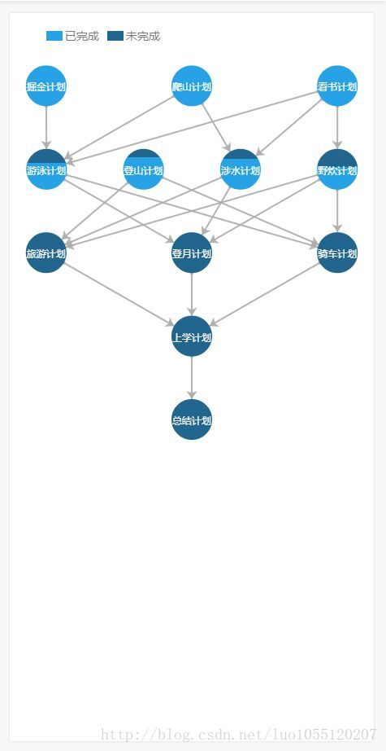
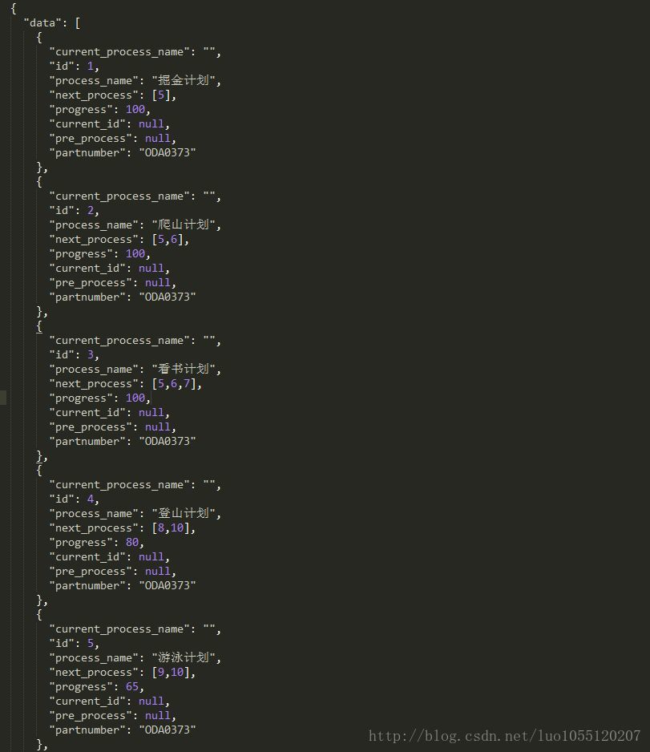
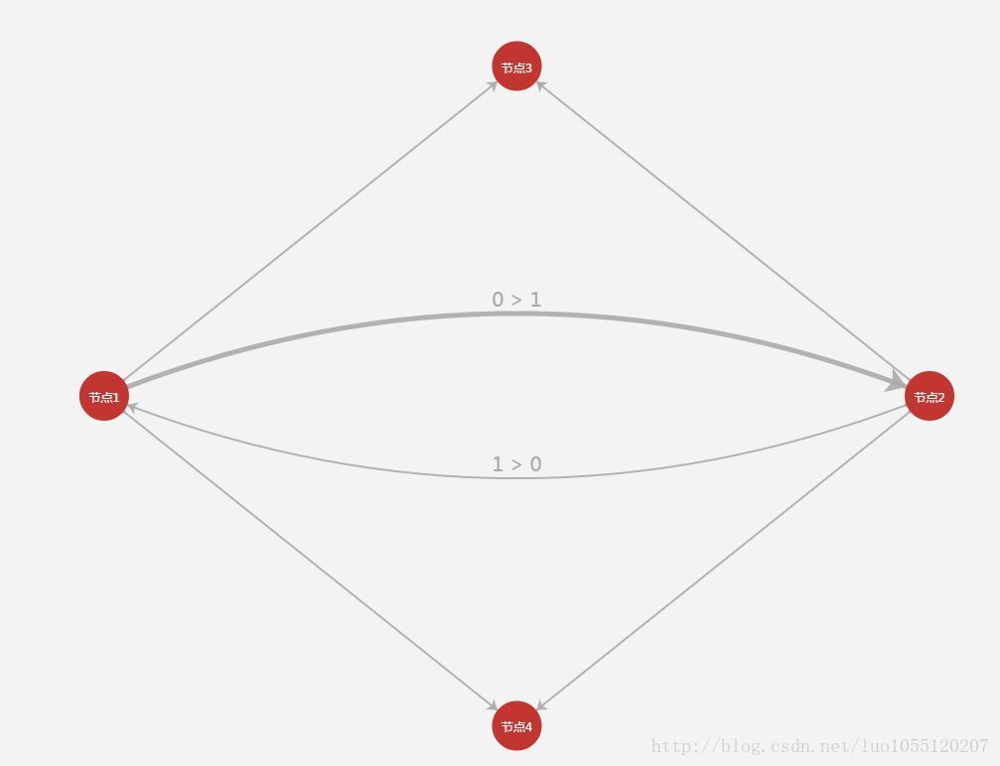
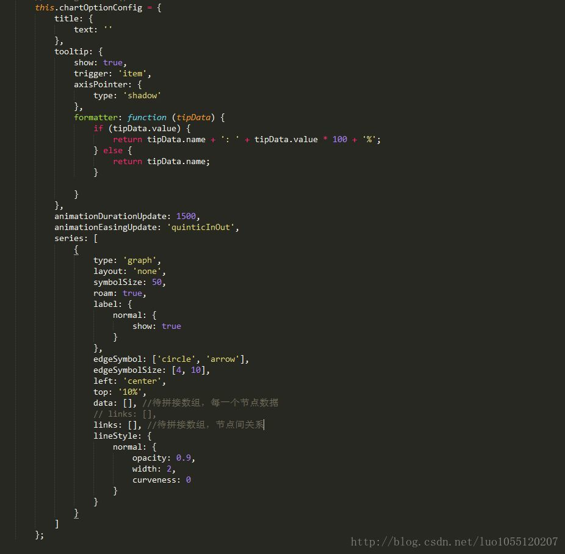
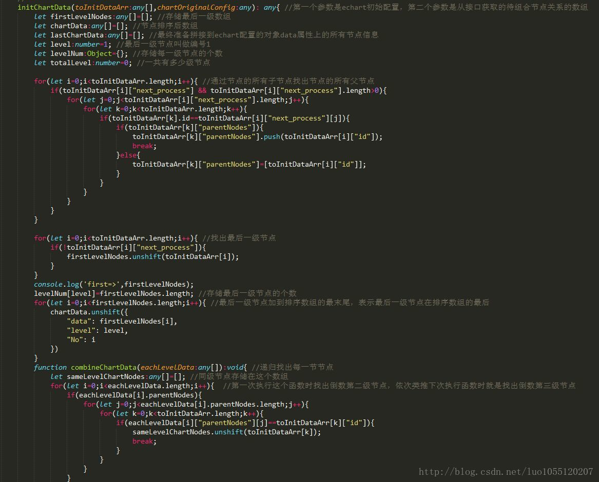
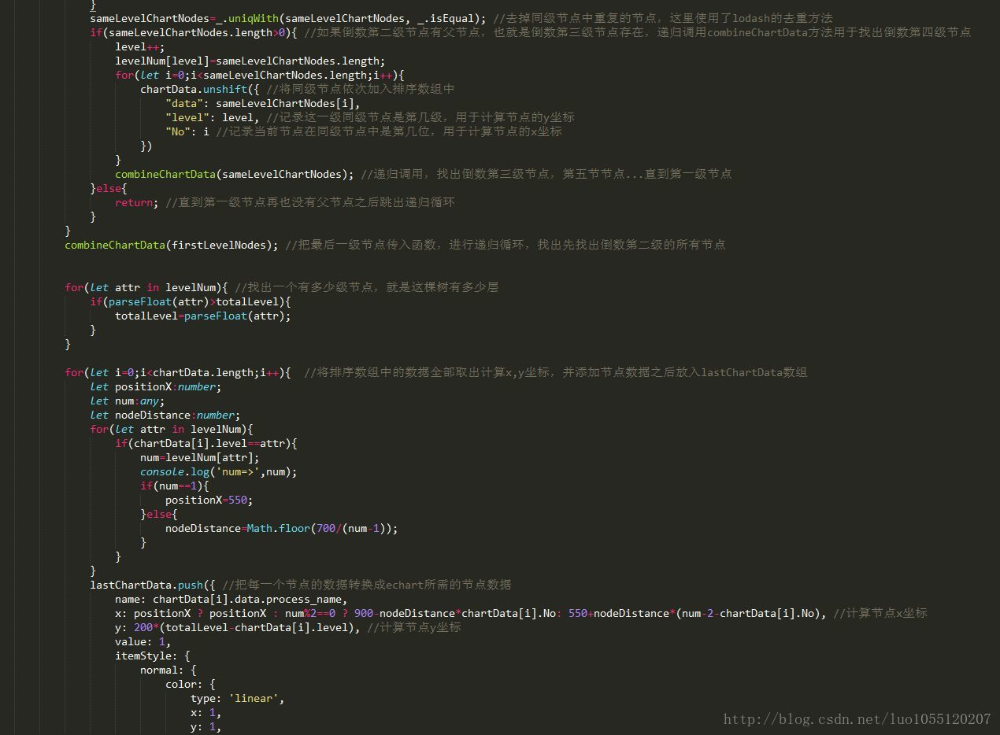
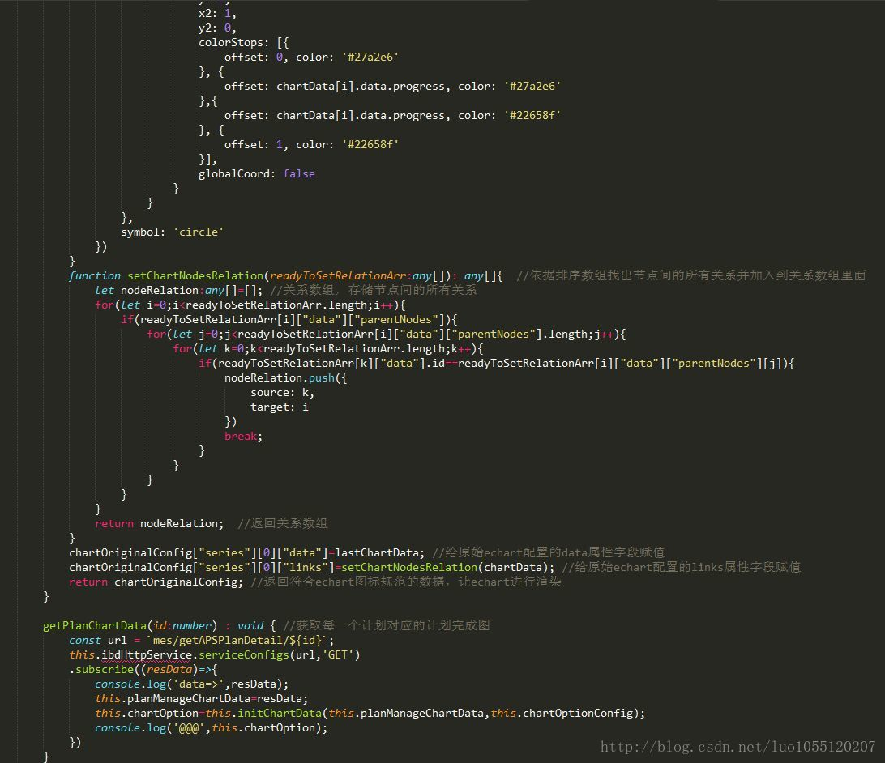

## 1.前言
最近接到一个新需求，需要写一个新模块，这个模块主要是用于查看当前每个生产计划的完成情况，然后所有的生产计划都列在了表格里，而流程控制图用于直观展示选中的生产计划的完成进度

## 2.流程控制图效果展示


## 3.分析后端数据接口

data属性对应后台返回的数据，是一个数组，数组里面的元素对应流程控制图的每一个节点，id字段表示当前节点的id号，用于关联其他节点，next-process字段是一个数组，用于表示该节点的子节点，process表示当前节点计划完成了多少，pre-process字段在这里不是表示该节点的所有父级节点

## 4.echart的Graph图及其配置
Graph图的原始配置，我稍微做了更改，就是links属性中的每一个元素代表了节点间的关系，由于生产计划的名称可能存在重名的情况，所以我们改用节点元素在data属性中的索引来建立节点之间的联系
```js
option = {
    title: {
        text: 'Graph 简单示例'
    },
    tooltip: {},
    animationDurationUpdate: 1500,
    animationEasingUpdate: 'quinticInOut',
    series : [
        {
            type: 'graph',
            layout: 'none',
            symbolSize: 50,
            roam: true,
            label: {
                normal: {
                    show: true
                }
            },
            edgeSymbol: ['circle', 'arrow'],
            edgeSymbolSize: [4, 10],
            edgeLabel: {
                normal: {
                    textStyle: {
                        fontSize: 20
                    }
                }
            },
            data: [{
                name: '节点1',
                x: 300, //节点在图上的x坐标
                y: 300 //节点在图上的y坐标
            }, {
                name: '节点2',
                x: 800,
                y: 300
            }, {
                name: '节点3',
                x: 550,
                y: 100
            }, {
                name: '节点4',
                x: 550,
                y: 500
            }],
            // links: [],
            links: [{
                source: 0,
                target: 1,
                symbolSize: [5, 20],
                label: {
                    normal: {
                        show: true
                    }
                },
                lineStyle: {
                    normal: {
                        width: 5,
                        curveness: 0.2
                    }
                }
            }, {
                source: 1,
                target: 0,
                label: {
                    normal: {
                        show: true
                    }
                },
                lineStyle: {
                    normal: { curveness: 0.2 }
                }
            }, {
                source: 0,
                target: 2
            }, {
                source: 1,
                target: 2
            }, {
                source: 1,
                target: 3
            }, {
                source: 0,
                target: 3
            }],
            lineStyle: {
                normal: {
                    opacity: 0.9,
                    width: 2,
                    curveness: 0
                }
            }
        }
    ]
};
```
该段配置对应的原始Graph图


## 5.我的思考
* 我开始的想法是既然给出了next-process字段，也就知道了当前节点的下级子节点，所以我开始的想法也是从上往下构建树就行了
* 首先构建这棵树我的想法是由于节点之间的联系依赖于节点在data属性对应的数组中的索引（也就是在data属性中的位置），所以我们只能一级一级的找出同级节点
* 然后给每一级同级节点编号，比如第一级的节点有三个元素掘金计划，爬山计划，看书计划，所以这三个节点属于同一个级别
* 但是我这里想说的是，登山计划理应属于第二级的节点，但是你找第一级节点肯定是找那些没有父级节点的节点，所以这里就有问题了
* 登山计划和掘金计划，爬山计划，看书计划成了同一级别，这样计算位置肯定会有问题，所以我决定从下往上拼树就可以完美避开这个问题
* 但是从下往上拼树就有一些小地方需要特别处理，就是纵坐标的位置怎么确立
* 我首先就找出了最后一个节点，我怎么知道把它的y坐标设置成多少，放在哪里？
* 我灵机一动，第一次循环只把所有的节点分出级别，然后第二次循环再根据级别确定y轴的坐标位置并添加节点信息，第三次循环找出所有节点之间的联系，给它们加上指向箭头

## 6.具体实现
echart原始配置数据：


具体实现（这三幅图是一个函数）：




##### 有错或者有更好的实现方式欢迎指正和交流！！！
