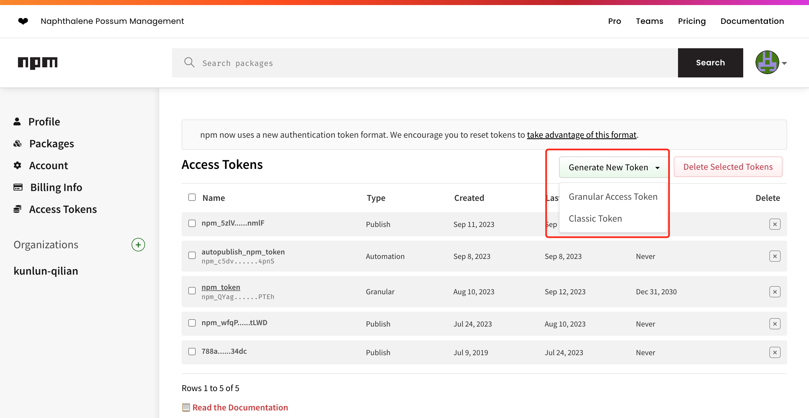

## 1.注册npm账号
打开[npm官网](https://www.npmjs.com)，并注册自己的npm账号

## 2.申请AccessToken
1.登录npm官网，登录成功后，点开右上角头像，并点击Access Tokens选项


2.点开Generate New Token下拉框，点击Classic Token(和Granular Access Token有什么区别，请自行查验？)


3.填写token信息，选择token类型为Automation(可以避免2FA校验)，保存申请的token信息(等下会用到)

## 3.github新建代码仓库
在github上面创建新的空仓库


## 4.修改仓库设置
1.进入新建的代码仓库，点击仓库tab选项卡的Settings


2.点开Secrets and variables选项卡，点击Actions选项，点击对应页面的New repository secret按钮


3.新建名称为NPM_TOKEN的secret, 并将刚刚申请到的npm token(前面要你保存的token)填入secret字段


## 5.新增ci文件
在代码根目录新建.github/workflow/ci.yml文件，文件内容如下
```yaml
name: CI
on:
  push:
    branches:
	  # 触发ci/cd的代码分支
      - master
jobs:
  build:
    # 指定操作系统
    runs-on: ubuntu-latest
    steps:
      # 将代码拉到虚拟机
      - name: Checkout repository
        uses: actions/checkout@v2
      # 指定node版本
      - name: Use Node.js
        uses: actions/setup-node@v3
        with:
          node-version: '16.x'
          registry-url: 'https://registry.npmjs.org'
      # 依赖缓存策略
      - name: Cache
        id: cache-dependencies
        uses: actions/cache@v3
        with:
          path: |
            **/node_modules
          key: ${{runner.OS}}-${{hashFiles('**/pnpm-lock.yaml')}}
      # 安装pnpm
      - name: Install pnpm
        run: npm install -g pnpm@7.5.0
      # 依赖下载
      - name: Installing Dependencies
        if: steps.cache-dependencies.outputs.cache-hit != 'true'
        run: pnpm install
      # 打包
      - name: Running Build
        run: pnpm run build
      # 测试
      - name: Running Test
        run: pnpm run test-unit
      # 发布
      - name: Running Publish
        run: npm publish
        env:
          # NPM_TOKEN is access token
         NODE_AUTH_TOKEN: ${{secrets.NPM_TOKEN}}
```

使用npm进行包管理，则采用如下代码
```yaml
name: CI
on:
  push:
    branches:
      # 触发ci/cd的代码分支
      - master
jobs:
  build:
    # 指定操作系统
    runs-on: ubuntu-latest
    steps:
      # 将代码拉到虚拟机
      - name: Checkout repository
        uses: actions/checkout@v2
      # 指定node版本
      - name: Use Node.js
        uses: actions/setup-node@v3
        with:
          node-version: '16.x'
          registry-url: 'https://registry.npmjs.org'
      # 依赖缓存策略
      - name: Cache
        id: cache-dependencies
        uses: actions/cache@v3
        with:
          path: |
            **/node_modules
          key: ${{runner.OS}}-${{hashFiles('**/package-lock.json')}}
      # 依赖下载
      - name: Installing Dependencies
        if: steps.cache-dependencies.outputs.cache-hit != 'true'
        run: npm install
      # 打包
      - name: Running Build
        run: npm run build
      # 测试
      - name: Running Test
        run: npm run test-unit
      # 发布
      - name: Running Publish
        run: npm publish
        env:
          # NPM_TOKEN is access token
         NODE_AUTH_TOKEN: ${{secrets.NPM_TOKEN}}
```

## 6.推送代码至github
在代码目录初始化git，并将代码推送到刚刚github上面新建的代码仓库master分支，会自动触发ci/cd进行自动化发包