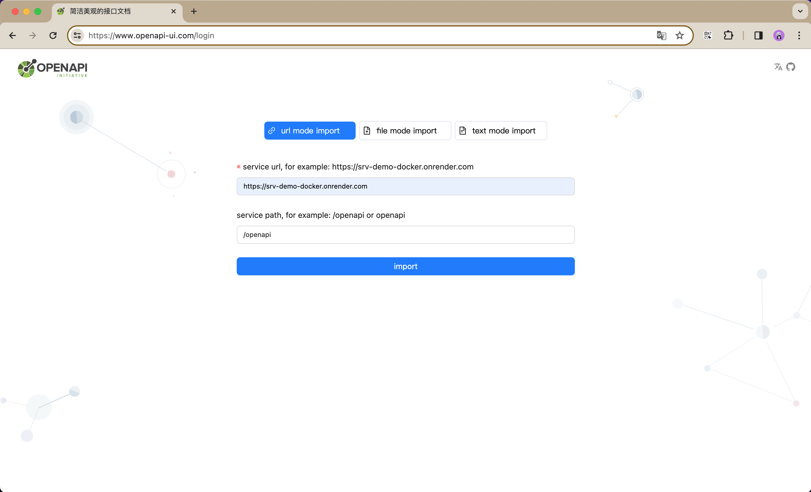

## 1.背景
* 由于长期使用 swaggerUI 工具，它的轻量风格个人觉得还是不错的，但是它的整体使用体验确实不好，用过的可能都有体会，这里就不一一列举了（由于语言表达能力有限，手动🐶保命，毕竟我在说鼻祖，等下会不会被砍😭）
* 开源的openapi文档redoc，由于默认的服务器在国外，测试调用接口体验也不咋好，还有就是UI风格有点不习惯，可能看习惯了swaggerUI的缘故
* 强大的apifox，除了强行喷不喜欢它的UI风格，请求参数和model定义成嵌套表格展示有点难受，好像找不出什么理由了😂，整体还是灰常好用的
* 以上种种其实都是废话，不装了，摊牌了，强行找的理由而已😂

## 2.简单介绍下openapiUI(对标swaggerUI)
* 2.1.openapiUI是一个简单轻量、比 swagger-ui 更美观的 openapi 接口文档，可以快速的生成模拟请求参数并调用 api 请求
* 2.2.openapiUI的github地址是：[github.com/rookie-luochao/openapi-ui](https://github.com/rookie-luochao/openapi-ui)，求star，求一起共同建设，灰常感谢🙏

## 3.openapiUI网站域名
* CN: [www.openapi-ui.com](https://www.openapi-ui.com)
* US: [docs.openapi-ui.com](https://docs.openapi-ui.com)

## 4.项目技术栈
* 因为项目功能不是特别复杂，也不需要考虑兼容性，所以项目的技术栈非常新颖，追着版本跑的那种，如同有需要你可以学习下项目的技术架构
* 项目主要技术栈为：vite5 + react18 + typescript5 + react-router6 + antd5 + zustand4 + emotion(cssinjs) + docker + docker容器化部署 + docker环境变量注入
* 项目工程化配置为：eslint + typescript-eslint + husky + lint-staged + prettier + commitlint
* 如果你做业务开发的话，推荐增加[openapi2typescript](https://github.com/chenshuai2144/openapi2typescript)，可以自动生成axios请求和接口的ts定义、[react-query](https://github.com/TanStack/query)，可以自动实现自动loading和接口联动，具体如何结合使用可以参考我搭建的[前端开发脚手架](https://github.com/rookie-luochao/create-vite-app-cli)，目前支持react18模板、vue3模板，我们可以一起完善模板的技术栈和UI Layout结构

## 5.目前支持的数据格式
* 5.1.支持swagger2规范，json或者yaml，即：swagger2.json/swagger2.yml
* 5.2.支持openapi3规范，json或者yaml，包含3.0.x、3.1.x，即：openapi3.json/openapi3.yml

## 6.目前支持的3种使用方法
* 6.1.输入 swagger2/openapi3 的网关地址，这种使用方式的前提是openapi文档已经做成了 get 接口，这种使用方法可以分享url，别人拿到url可以回显到你当前正在测试的接口
* 6.2.上传 swagger2/openapi3 文件，由于是上传的文件，数据太大，url无法携带，后面尝试使用base64测试一下
* 6.3.输入 swagger2/openapi3 文本，同2

## 7.快速生成模拟接口请求参数
* 其实整个文档比较关键的一部分就是mock请求参数的合理性，暂时只是比较粗略的一个mock，后续会重点对mock策略进行升级
* 如果 openapi 接口请求参数 schema 定义了 format 字段，则使用[openapi-sampler](https://github.com/Redocly/openapi-sampler) 去生成模拟请求参数，具体的规则可以点击 url 跳转查看，它也只是简单的一个mock
* 如果 openapi 接口请求参数 schema 没有定义 format 字段，则使用 faker 去生成模拟请求参数，预定义了一些[参数名称规则](https://github.com/rookie-luochao/openapi-ui/blob/master/src/openapi/requestMock.ts#L8)，如果请求参数的名称正好命中这些预定义的参数名称，则按照命中规则进行mock数据，如果参数名称没有命中预定义的规则，则根据参数类型简单进行mock

## 8.手动填写body复杂数据结构
* 引入 monaco-editor 编辑器，填写任何字段都会有类型提示，增加填写数据的友好性

## 9.支持多语言、提供一个国际化接入模板
* 9.1.支持中文
* 9.2.支持英语

## 10.为方便开发，支持一些全局配置
* 10.1.支持配置接口请求超时时间，默认的接口超时时间是2分钟，为了测试接口的灵活性，如果有些接口需要快速响应，等待2分钟那简直要命，所以将接口超时时间做成可配置，方便调试
* 10.2.支持配置接口请求Authorization，因为大部分的接口都需要Authorization，如果切换接口都需要重新填写Authorization的话，显然很不安逸。程序员个体大部分都是讨厌手动重复的团队，所以怕麻烦的可以全局配置一下Authorization，这样每个接口都不用填写了。如果有些接口的Authorization和全局的Authorization不一致也不要紧，你在当前接口重新填写一下，会覆盖全局的Authorization，这样就避免了被全局Authorization干扰。或者特殊接口你就重新取个header key，例如：x-code，这样页面的参数都不会显示Authorization，更加不会冲突了

## 11.对于接口不能跨域请求
* 目前还没有对跨域做支持，但是会尽快加上

## 12.对于不能连接内网api
* 如果不能连接内网api的情况, en...好像也没什么好办法，你可以在本地运行此项目或者使用 docker 在本地或者服务器部署此项目，这样你就可以愉快的访问内网api了

## 13.如果你想分享某个接口的url给别人快速定位
* 为了保持url的简洁性, 如果想要分享url供他人快速访问，则需要点击页面右上角的 分享url按钮 生成分享链接，然后再进行分享。其实是可以直接把 api 地址啥的挂在 query 上的，那样分享起来更方便，但是个人喜欢简洁点的url(轻微强迫症患者)，后续讨论一下怎么挂参数吧

## 14.如果你想同时查看多个api网关
* 由于本项目就是个纯粹的前端静态页面，并没有接入后端进行状态管理，API存储管理等功能，所以暂时就不具备存档的能力。
* 该 openapiUI 项目默认的缓存策略是session storage, 可以同时打开多个页面去查看多个 api 网关

## 15.未来的展望
* 由于刚开发出来，还没有怎么使用，bug还很多，需要不断修复bug
* 精细化的支持openapi3.0.x和3.1.x，做到都能正常展示
* 优化mock策略，更好的模拟请求参数
* 增加跨域访问的能力
* 支持一套暗黑主题
* 考虑增加：点击schema生成typescript的interface功能