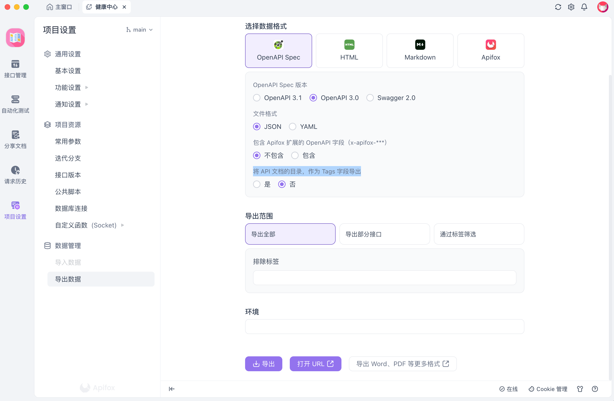

## 1. 背景
- 刚入行时，我们的接口文档基本上都是txt、wps、postman手写，但是其实后端也不愿意写，更不愿意测，接口文档也不会和代码同步
- 后来出来了各种 api 规范，比较出名的就是 swagger/openapi 规范了，后端按这些规范实现代码注解就可以生成接口文档，还有接口配置，但是注解有时候忘记更新，因为写注解也是一种额外开销，但是想想可以方便后端自己测试、测试人员测试、前端人员测试，后端咬咬牙也就坚持下来了
- 可能写注解确实也是一种额外开销，也容易和代码不同步，所以有没有一种直接解析代码，生成接口文档、接口配置的工具呢，apifox + apifox-ide插件或许是这一块做的稍微好点的了吗？
- 其他的我们就不啰嗦了，前端是否可以利用接口配置生成各种请求 clent 代码呢，这无疑是可以的，但是很多人都没有这个概念，就连一些出名的开源应用都是手写client，如果是自动生成 + 结合ts提示，可以省去很多维护client的精力，这对前端同学无疑是更友好的，而且后端偷偷改接口也很容易轻易发现


## 2. 导语
- 此篇文章普及如果避免手写请求client，当然这不是没有代价的，需要后端同学支持^_^
- 如果你司正在使用 apifox/swagger/openapi 文档规范技术，似乎你生成请求 client 将是非常容易的事情
- 以下将以 apifox/swagger/openapi 文档讲解如何生成请求client
- 使用 [openapi-ts-request](https://github.com/openapi-ui/openapi-ts-request) 生成请求client

以下是我的【故城瞎折腾系列】文章

> 第一篇：[故城瞎折腾系列第一期【你要不要动手封装个前端Docker容器玩一玩】](https://juejin.cn/post/7414045785636454440)  
> 第二篇：[故城瞎折腾系列第二期【都2024年了，你还在手动部署前端项目吗】](https://juejin.cn/post/7416922427156348963)<br>
> 第三篇：[故城瞎折腾系列第三期【你看我这样用Nginx部署前端Docker项目，姿势对不对】](https://juejin.cn/post/7417458673717575695)<br>
> 第四篇：故城瞎折腾系列第四期【都4024年了，你的uniapp应用还在手写接口请求吗】


## 3. 已有 Swagger/Openapi 接口文档，生成请求client

1. 打开 swagger/openapi 官方文档，这里以 swagger [官方的demo文档](https://petstore.swagger.io)为例子
2. 你会在界面上清晰的看到文档引用的接口配置文件是 [petstore.swagger.io/v2/swagger.json](https://petstore.swagger.io/v2/swagger.json)
3. 这个文件如果你采用了 swagger/openapi 技术的话，后端执行命令就会默认生成接口配置文件，比较出名的是 java 的[knife4j](https://doc.xiaominfo.com)，golang的[swag](https://github.com/swaggo/swag)
4. 使用 [openapi-ts-request](https://github.com/openapi-ui/openapi-ts-request) 生成请求client、ts、枚举、字段英译汉等等
5. 以下演示如何利用 [petstore.swagger.io/v2/swagger.json](https://petstore.swagger.io/v2/swagger.json) 接口配置来生成请求client，默认是使用 axios 客户端

在前端项目根目录新建 `openapi-ts-request.config.ts` 文件，然后加入以下代码：

```ts
import type { GenerateServiceProps } from 'openapi-ts-request';

export default [
  {
    schemaPath: 'https://petstore.swagger.io/v2/swagger.json',
  },
] as GenerateServiceProps[];
```

在 `package.json` 文件的 `script` 中添加命令: `"openapi": "openapi-ts"`

生成结果：
```bash
npm run openapi
```

如果我们想在 uniapp 中使用，那么肯定不能用 axios 客户端, 可以用 `@uni-helper/axios-adapter` 来适配 `uni.request` 请求

1. 下载 `@uni-helper/axios-adapter` npm包
2. 修改 `openapi-ts-request.config.ts` 文件为如下代码

```ts
import type { GenerateServiceProps } from 'openapi-ts-request';

export default [
  {
    schemaPath: 'https://petstore.swagger.io/v2/swagger.json',
    requestImportStatement: `import request from 'axios';\n
import { createUniAppAxiosAdapter } from '@uni-helper/axios-adapter';\n
request.defaults.adapter = createUniAppAxiosAdapter();`,
  },
] as GenerateServiceProps[];
```

正常情况我们都需要对 axios 进行封装，例如增加拦截器处理添加Token，亦或是处理请求错误的情况，所以我们需要封装自己的 request 方法，用 [openapi-ts-request](https://github.com/openapi-ui/openapi-ts-request) 当然可以方便的支持，过程如下：

1. 封装自己的自定义 axios 函数，假如 request 函数路径在 `src/core/request/index.ts` 目录，并且设置了 alias 别名
2. 修改 `openapi-ts-request.config.ts` 文件为如下代码

```ts
import type { GenerateServiceProps } from 'openapi-ts-request';

export default [
  {
    schemaPath: 'https://petstore.swagger.io/v2/swagger.json',
    requestLibPath: '@/core/request',
  },
] as GenerateServiceProps[];
```

axios 简单封装，参考如下代码：

```ts
import { notification } from 'antd';
import axios, { AxiosRequestConfig } from 'axios';

import {
  ILoginInfoStorageState,
  defaultLoginInfoStorage,
  loginInfoStorageKey,
} from '@/store';

const BASE_URL = 'https://localhost:port';

const instance = axios.create({
  baseURL: BASE_URL,
  headers: {
    'Content-Type': 'application/json',
  },
  timeout: 120000, // 超时时间120秒
});

instance.interceptors.response.use(
  (response) => {
    // data解构
    if (response.data) {
      return response.data;
    }
    return response;
  },
  (error) => {
    // 统一错误处理
    if (error.response.status >= 300) {
      notification.error({
        message: error.response.data?.msg,
        duration: 2,
      });
    }
    return Promise.reject(error);
  }
);

instance.interceptors.request.use((config) => {
  const loginInfoStorageStr =
    globalThis.localStorage.getItem(loginInfoStorageKey);
  const loginInfoStorage = loginInfoStorageStr
    ? (JSON.parse(loginInfoStorageStr) as ILoginInfoStorageState)
    : defaultLoginInfoStorage;

  if (loginInfoStorage.state.loginInfo) {
    config.headers.Authorization = loginInfoStorage.state.loginInfo.accessToken;
  }

  return config;
});

const request = async <T = unknown>(
  url: string,
  options: AxiosRequestConfig = {}
) => {
  return await instance.request<T, T>({
    url,
    ...options,
  });
};

export default request;
```

自定义 uniapp.request 封装，参考以下代码：

```ts
export default async function request(url, options = {}) {
  return new Promise((resolve, reject) => {
    const {
      method = 'GET',
      headers = {},
      data = {},
      timeout,
      responseType = 'json',
      withCredentials,
      ...otherOptions
    } = options;

    uni.request({
      url,
      method,
      header: headers,
      data,
      timeout,
      dataType: responseType === 'json' ? 'json' : 'text',
      withCredentials, // 用于跨域请求时是否携带凭证
      ...otherOptions,
      success: (res) => {
        // 构造符合 Axios 的响应对象
        const response = {
          data: res.data,
          status: res.statusCode,
          statusText: res.errMsg,
          headers: res.header,
          config: options,
          request: res
        };
        // 根据 HTTP 状态码判断请求是否成功
        if (res.statusCode >= 200 && res.statusCode < 300) {
          resolve(response);
        } else {
          reject(response);
        }
      },
      fail: (error) => {
        // 构造符合 Axios 错误格式的对象
        const err = {
          message: error.errMsg || 'Request failed',
          config: options,
          request: error
        };
        reject(err);
      }
    });
  });
}
```

## 4. 已有 Apifox 接口文档，生成请求client

Apifox文档，作者暂时还没找到接口配置文件，按理说不应该啊，难道只能使用 Apifox 桌面端的手动导出接口文档功能吗？有没有知道的小伙伴评论区告知一下？

1. 打开 Apifox 桌面客户端
2. 选择需要查阅 API 文档的服务，点击进入
3. 点击服务左侧工具栏目中的 `项目设置` 
4. 点击 `导出数据`
5. 选择 OpenAPI Spec 版本：`OpenAPI3.0` ，文件格式：`JSON`，包含 Apifox 扩展的 OpenAPI 字段（x-apifox-***）：`不包含`，将 API 文档的目录，作为 Tags 字段导出：`否`
6. 点击 `打开URL` 按钮，会生成临时的接口文档链接：`http://127.0.0.1:4523/export/openapi/2?version=3.0`
7. 修改 `openapi-ts-request.config.ts` 文件为下面的代码

```ts
import type { GenerateServiceProps } from 'openapi-ts-request';

export default [
  {
    schemaPath: 'http://127.0.0.1:4523/export/openapi/2?version=3.0',
    requestLibPath: '@/core/request',
  },
] as GenerateServiceProps[];
```




## 5. 结语
* 介绍了如何利用已有的 Swagger/Openapi 接口文档，生成请求client
* 介绍了如何利用已有的 Apifox 接口文档，生成请求client
* 介绍了使用 [openapi-ts-request](https://github.com/openapi-ui/openapi-ts-request) 生成请求client
* 介绍了如何自定义 request 函数，基于 axios 实现封装
* 介绍了如何自定义 request 函数，基于 uni.request 实现封装
* 看都看完了，还不动手操作一波
